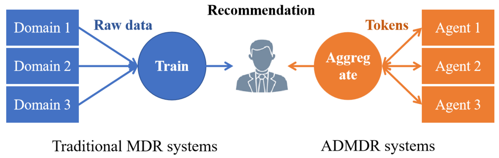
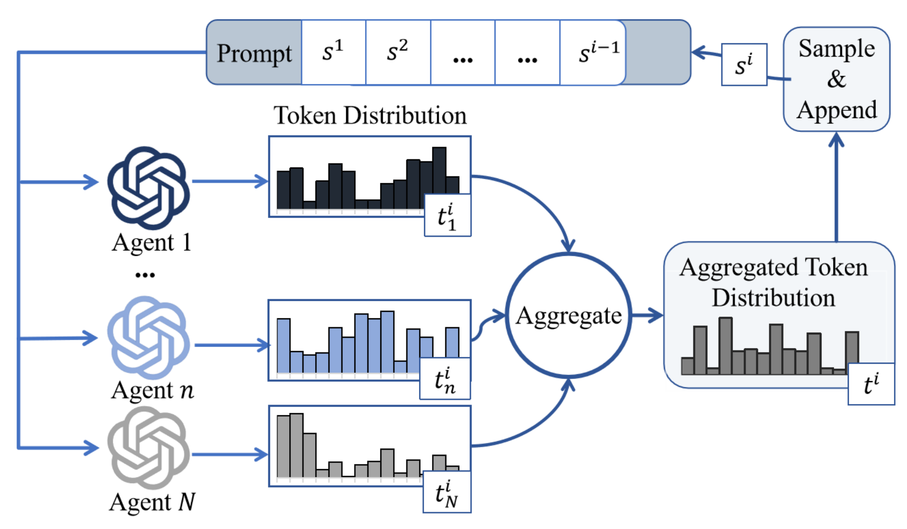

# Multi-LLM Domain Recommender

Source code for paper "Mechanism Design for Agent-driven Multi-domain Recommender System".



Agent-driven multi-domain recommender (ADMDR) systems increasingly power multi-domain recommender systems through multi-agent collaboration. This calls for a cost-effective and truthful incentive mechanism. In this paper, we develop the Verification-based Truthful Incentive (VeriTi) mechanism to quantify agent contributions fairly and establish the relation between the contribution and capability of agents. 

The code shown here is mainly for the output token aggregation process.



We exemplify the usage of our code with the collaboration of 3 Mistral-7B models on the self-defined dataset.

## Usage

### Step-1: Construct Relative Representation Matrix

```bash
export CUDA_VISIBLE_DEVICES=0,1
export PYTHONPATH=${PYTHONPATH}:$(pwd)
python src/transfer_matrix/cal_and_save_transfer_matrix.py \
    ${relative_representaton_matrix_save_path} \
    ${Mistral_7B_path} \
```

### Step-2: Construct Inverse Relative Representation Matrix

Run python file in /transfer_matrix/represent_matrix_inverse.py

Revise the file relative representation matrix path and cuda setting


### Step-3: Configuration

```
vim confs/Self_defin/3_Mistral.json
```

Fill in the following fileds:

- `model_path`: Paths to the model
- `probability_transfer_matrix_path`: Directory path to the constructed relative representation matrix
- `probability_transfer_inv_matrix_path`: Directory path to the constructed inverse relative representation matrix
- `file_path`: Paths to the example prompt and the validation and test datasets, which are also provided in this repository (./datasets)

### Step-3: Inference

For a three-model ensemble, run the test dateset with the following script:

```export CUDA_VISIBLE_DEVICES=2,5,6,7
res_path=output_dir
mkdir -vp ${res_path}
python src/test.py \
  --config confs/Self_defin/Mistral.json \
  -lpm based_on_probility_transfer_logits_fp32_naive_processor \
  -dp cuda:1 -d1 cuda:2  \
  -rsd ${res_path}\
```

Where:

- `-lpm`: Model ensemble strategy, detailed in `src/logits_processor/model_processor_factory.py`
- `-rsd`: Result storage path, default to `./`
- `-dp`: gpu for naive model and rest assistent models


## Requirements
- torch==2.1.2
- transformers==4.37.2

